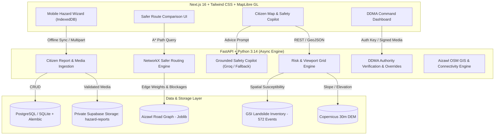

# 🛡️ Dhara Drishti — AI-Assisted Landslide Risk & Connectivity Intelligence

> **Smart India Hackathon (SIH) Prototype**  
> *Pilot Demonstration Region: Aizawl District, Mizoram, India (`92.60°E, 23.60°N` to `92.85°E, 23.85°N`)*

---

## 🌟 Overview

**Dhara Drishti** is an AI-assisted landslide risk estimation and disaster connectivity intelligence platform designed for complex Himalayan and North-Eastern terrains. Unlike generic weather or mapping dashboards, Dhara Drishti strictly enforces **grounded, evidence-backed geospatial modeling** across:

1. **Multi-Source Hybrid Risk Engine**: Combines **Copernicus 30m DEM** slope/elevation, **572 Geological Survey of India (GSI)** historical landslide events, an experimental **XGBoost susceptibility model**, and **CHIRPS/IMD** rainfall telemetry.
2. **Safer vs. Fastest Graph Routing**: Uses a pre-computed **NetworkX directed road graph** derived from **116,763 OpenStreetMap (OSM) segments in Aizawl** to route citizens and emergency responders away from high-hazard segments, calculating real risk reduction percentages and extra travel time.
3. **Citizen Mobile Hazard Reporting & Offline Sync**: 7-step wizard with browser GPS accuracy capture, 10 standardized disaster categories, photo/video camera capture, private Supabase Storage signed pipelines, and **IndexedDB offline queuing** with automatic network re-sync.
4. **Grounded AI Safety Copilot**: "WHAT SHOULD I DO?" situational guidance powered by **Groq LLaMA-3.3-70b-Versatile** with deterministic multilingual fallback in **English (`en`)**, **Hindi (`hi`)**, and **Mizo (`lus`)**.
5. **District Disaster Management Authority (DDMA) Command Center**: Desktop-first operations hub featuring incident clustering, report verification queues with expiring private signed media previews, official road closure toggles (which disable routing graph edges), village isolation simulations, and emergency hospital reachability queues.

---

## 🏛️ Grounded Reality & Safety Principles

Dhara Drishti strictly adheres to high-consequence public safety data ethics:

- ❌ **No Predictive Hallucination**: The XGBoost model provides *spatial susceptibility conditioning*, never claiming to forecast exact future landslide timestamps.
- ❌ **No Unverified Road Closures**: Citizen reports create incident candidates. **Only official DDMA verification** or explicit closure overrides remove edges from the active routing network.
- ❌ **No Disguised Telemetry**: When real-time IMD weather station API keys are unconfigured, the system explicitly displays `IMD LIVE WEATHER: NOT CONNECTED` alongside `CHIRPS Historical Reference Scenario`, rather than masquerading historical data as live readings.
- ❌ **No Public Storage Buckets**: Citizen-submitted photos and videos are stored in private Supabase buckets via backend service-role validation, served exclusively to authenticated officers via short-lived signed URLs.

---

## 🏗️ Architecture & Technology Stack



---

## 📁 Repository Structure

---

## 🚀 Quickstart Guide

### Prerequisites
- Python 3.10+ (Tested on Python 3.14)
- Node.js 18+ (Tested on Node.js 20/22)
- Git

### 1. Backend Setup

```bash
# Navigate to backend
cd backend

# Create virtual environment & activate
python -m venv .venv
source .venv/bin/activate  # On Windows: .venv\Scripts\activate

# Install Python dependencies
pip install -r requirements.txt

# Create environment configuration
cp .env.example .env
# Windows (cmd): copy .env.example .env

# Run test suite to verify backend health
pytest backend/tests

# Start FastAPI development server
uvicorn app.main:app --reload --port 8000
```

Database tables are created automatically on first startup. FastAPI OpenAPI Interactive Documentation: `http://localhost:8000/docs`

---

### 2. Frontend Setup

```bash
# Navigate to frontend
cd frontend

# Install Node dependencies
npm install

# Configure environment
cp .env.example .env.local
# Windows (cmd): copy .env.example .env.local

# Run production build validation
npm run build

# Start Next.js development server
npm run dev
# If port 3000 is already in use: npm run dev -- --port 3001
```

Frontend Application: `http://localhost:3000`

---

## 🔑 Operational Credentials & Environment Keys

| Variable | Scope | Purpose | Default / Fallback |
| :--- | :--- | :--- | :--- |
| `GROQ_API_KEY` | Backend | Grounded AI Safety Copilot (LLaMA-3.3-70b) | Deterministic Rules Engine |
| `SUPABASE_URL` + `SUPABASE_ANON_KEY` | Backend | Supabase Auth JWT verification | Authority login unavailable until configured |
| `SUPABASE_SERVICE_ROLE_KEY` | Backend | Backend Private Uploads (Never in frontend) | Local Fallback |
| `NEXT_PUBLIC_SUPABASE_URL` + `NEXT_PUBLIC_SUPABASE_ANON_KEY` | Frontend | Supabase email/password sign-in | Authority login unavailable until configured |
| `IMD_API_KEY` | Backend | Real-time Indian Meteorological Dept API | Historical CHIRPS Reference |
| `NEXT_PUBLIC_API_BASE_URL` | Frontend | Target FastAPI Backend URL | `http://localhost:8000` |

---

## 🧪 Verification & Test Results

- **Backend Pytest Suite**: `19 / 19 tests passed` (API contracts, GIS connectivity, hybrid risk scoring, road exposure, offline report idempotency, signed media URLs).
- **Frontend Production Build**: `Next.js 16.3.4 (Turbopack)` compiled the citizen, help, routing, alerts, and authority routes with zero TypeScript errors.

---

## 📜 Smart India Hackathon (SIH) Compliance

| SIH Requirement | Dhara Drishti Implementation Status |
| :--- | :--- |
| **Landslide Hazard Modeling** | Multi-factor hybrid engine (Copernicus DEM slope, 572 GSI events, XGBoost susceptibility, CHIRPS/IMD). |
| **Emergency Evacuation & Routing** | NetworkX Aizawl road graph; calculates safest vs fastest paths, risk reduction %, and avoids verified closures. |
| **Citizen Hazard Crowdsourcing** | 5-step mobile wizard with GPS/map pin, 9 quick categories, optional photo/video, and IndexedDB offline queue. |
| **Local Language Support** | Trilingual interface in **English**, **Hindi (हिंदी)**, and **Mizo (Mizo ṭawng)**. |
| **Disaster Authority Dashboard** | DDMA incident clustering, report verification, signed media inspection, road closure broadcast, and hospital reachability queue. |
| **Data Integrity & Privacy** | Private signed media URLs, no secret leakage, explicit data context banners (`LIVE`, `HISTORICAL`, `DEGRADED`). |

---

## 📄 License & Attribution

Developed for Smart India Hackathon. Open-source under Apache-2.0.  
- OpenStreetMap data © OpenStreetMap contributors (ODbL).  
- Landslide inventory data courtesy of Geological Survey of India (GSI).  
- Digital elevation data courtesy of Copernicus Sentinel/DEM program.